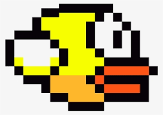

# Flappy_buddy
### Flappy-bird game but with your original character!

    Test image
    

[Try it!:bird:](https://miyabitanimchi.github.io/flappy_buddy/)

### Introduction
This is a Flappy Bird game with two original features. One is that you can also draw a character(your buddy!) on the canvas and play the game with it. The other one is that there are also bullets as obstacles.
This is a trainig project and is to learn about HTML canvas, how games on canvas work.

### Technologies
• Vanilla JS  
• HTML  
• CSS  

